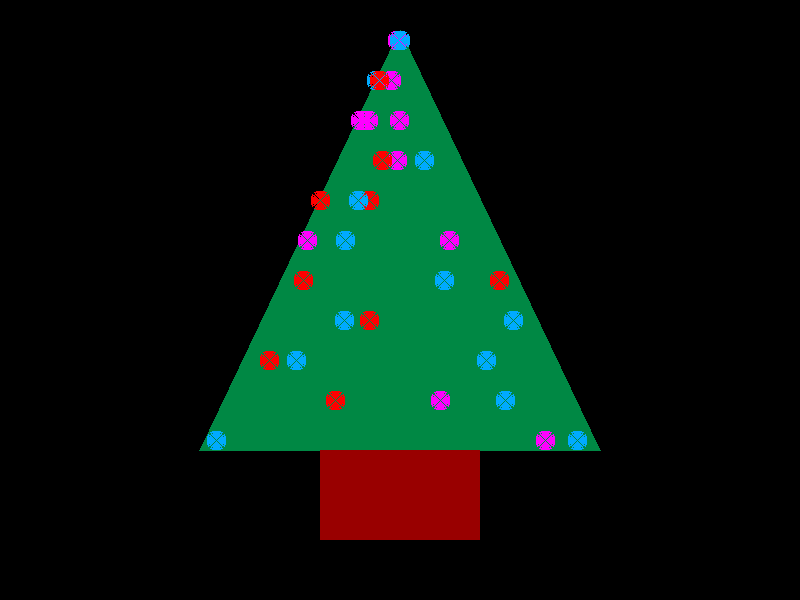

# Christmas Tree GIF Generator
A festive Christmas tree GIF generator implemented using only Golang standard
library code.

## Usage
Build from source using:

```shell
$ make build
```

Run the binary for the operating system of your choice from the `bin` directory

## Example


## Notes
The lights on the tree are particularly rubbish, likely due to the crude
circle drawing algorithm. Some improvements to be made here.